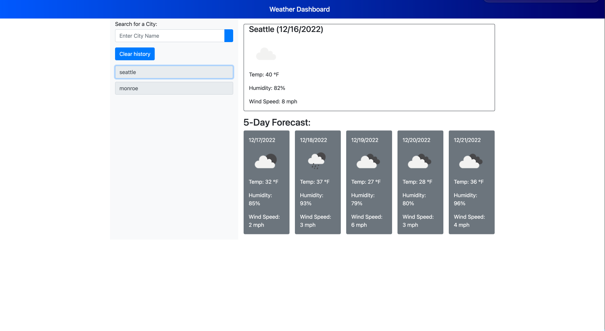

# Weather Dashboard
Javascript 5 day forcast

## Table of contents
* [General info](#general-info)
* [Website](#webpage-URL)
* [Screenshots](#screenshots)
* [Code](#Code)

## General info
Shows temperature, wind speeds, and humidity when user searches a city, inluding a full 5 day forcast. 

## Website
[JavaScript Weather Dashboard](https://anomic84.github.io/week6ch/)

## Screenshots

## Code 
* HTML
* CSS
* JavaScript
